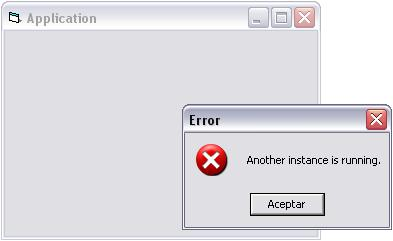

## \[ \!\] Check for PrevInstance

### Description

This code checks for a previous instance of the program. This is not like the App.PrevInstance property. This checks the prevInstance no matter the location of the file, or the name of the app. You don't have to call DestroyWindow to destroy the created window, since when you quit the application, it is self destroyed. This may not work in the VB IDE, because the window is created by VB6.EXE. In this case you can call DestroyWindow in the Form_Unload().
 
### More Info
 

             |
---                |---
**Submitted On**   |2005-04-17 10:05:56
**By**             |[Sergio del Rio](https://github.com/Planet-Source-Code/PSCIndex/blob/master/ByAuthor/sergio-del-rio.md)
**Level**          |Intermediate
**User Rating**    |4.9 (34 globes from 7 users)
**Compatibility**  |VB 6\.0
**Category**       |[VB function enhancement](https://github.com/Planet-Source-Code/PSCIndex/blob/master/ByCategory/vb-function-enhancement__1-25.md)
**World**          |[Visual Basic](https://github.com/Planet-Source-Code/PSCIndex/blob/master/ByWorld/visual-basic.md)
**Archive File**   |[\[\_\!\]\_Check1877774172005\.zip](https://github.com/Planet-Source-Code/sergio-del-rio-check-for-previnstance__1-60044/archive/master.zip)

